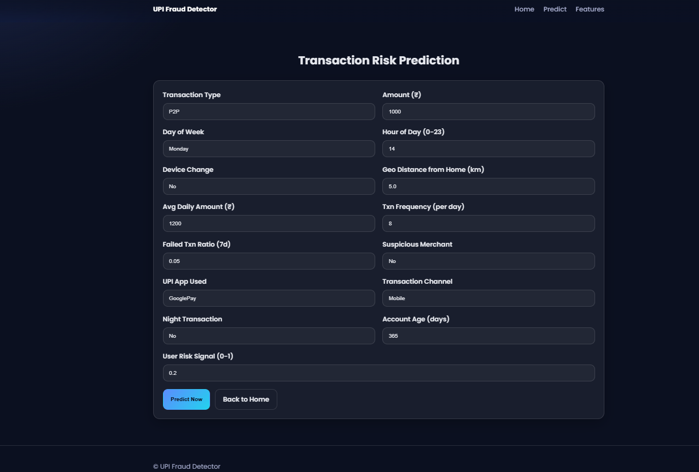

# UPI Fraud Detection System
A Machine Learning based Flask web application that detects fraudulent UPI transactions using trained ML models.
## Technologies Used
- Python
- Flask
- HTML
- CSS
- Bootstrap
- XGBoost
- Scikit-learn
- Pandas
- NumPy
## Features
- Fraud transaction detection
- Real-time prediction
- User-friendly interface
- ML-based analysis
- Secure transaction monitoring
## Project Structure
```bash
templates/ -> HTML pages
static/ -> CSS, JS, Images
models/ -> Trained ML models
ui screens/  -> Screenshots
```
## Run the Project
```bash
pip install -r requirements.txt
python app.py
```
Open:
```bash
http://127.0.0.1:5000
```
## Screenshots
### Home Page

### Freatures

### Prediction Page

### Results Page

## Author
Ommi Venkata Jaswanth
Computer Science Engineer
